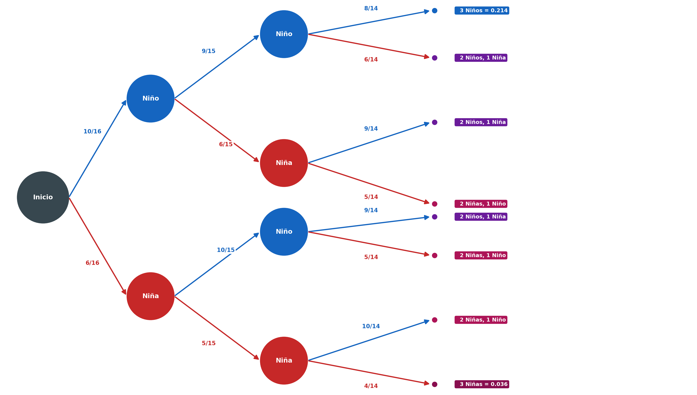

# Estadística I
# UNM - FCEQyN - 2025
## Valentino Mende
---
<!-- _class: lead -->
# 02
# Probabilidad
## Del azar a los números
---
La estadística descriptiva nos enseñó a *mirar* los datos.

Ahora queremos ir un paso más allá: **predecir**.

* ¿Qué tan probable es que ocurra algo?
* ¿Podemos cuantificar el azar?
* ¡Resulta que sí podemos, y con matemática rigurosa!

---
<!-- _class: lead -->
# Un poco de historia
## Porque nada surge de la nada.
---
# Origen de la Combinatoria

La combinatoria no nació en un aula. Nació de problemas concretos que la humanidad quería resolver.

* Los **cuadrados mágicos** aparecen en un libro chino fechado en el año 2200 a.C.
* Los **coeficientes binomiales** ya eran conocidos en el siglo XII.
* El **triángulo de Pascal** fue desarrollado en el siglo XIII, antes de que Pascal naciera.

---
En Occidente, la combinatoria se consolidó en el siglo XVII con los trabajos de **Pascal** y **Fermat** sobre juegos de azar.

El término *"combinatoria"* tal como lo usamos hoy fue introducido por **Leibniz** en su *Dissertatio de Arte Combinatoria*.

* Fue **Euler** quien desarrolló a principios del siglo XVIII una auténtica escuela de matemática combinatoria.
* También se lo considera el padre de la **teoría de grafos**, disciplina que hoy es central en informática.

---
# Origen de la Probabilidad

El azar siempre fascinó al ser humano.

* Los **sumerios y asirios** usaban el astrágalo, un hueso del talón de animales tallado para caer en cuatro posiciones: precursor del dado.
* Los **egipcios** registraban los resultados en tableros pintados en las tumbas de los faraones.
* La palabra **"azar"** proviene del árabe *al-azar*, que significa "dado". Dante ya la usaba en el *Purgatorio*.

---
La historia formal de la probabilidad comienza en el siglo XVII, cuando **Pascal y Fermat** intercambiaron una correspondencia histórica tratando de resolver problemas de juegos de azar.

En 1657, **Christian Huygens** publicó el primer libro sobre probabilidad: *De Ratiociniis in Ludo Aleae*.

* En 1812, **Laplace** publicó su *Théorie analytique des probabilités*.
* A mediados del siglo XIX, **Gregor Mendel** aplicó la probabilidad a la genética.
* Recién a principios del siglo XX, **Andrei Kolmogorov** la definió de forma axiomática, dándole a la probabilidad su forma matemática definitiva.

---
## Retomando...

Dos disciplinas que nacieron de dados, huesos y apuestas terminaron siendo el fundamento de la inteligencia artificial, la genética y la seguridad informática.

* La combinatoria y la probabilidad siempre estuvieron entrelazadas.
* Lo que sigue es formalizar lo que la humanidad tardó siglos en construir.

---
<!-- _class: lead -->
# 00
# Técnicas de Conteo y Combinatoria
## Antes de calcular probabilidades, hay que saber contar.
---
# ¿Por qué contar primero?

La teoría de probabilidades asigna un número a cada posible resultado de un experimento aleatorio, con el fin de cuantificar esos resultados y saber si un suceso es más probable que otro.

* Para hacer eso, necesitamos saber **cuántos resultados posibles existen**.
* Y cuántos de ellos nos **favorecen**.
* Aquí entra la **combinatoria**.

---
# Combinatoria

La combinatoria se encarga de encontrar todas las opciones posibles o agrupamientos que se pueden formar con un conjunto de elementos (m), organizados según algunos criterios.

* Es especialmente útil cuando hay un gran número de posibilidades.
* ¿Recuerdan la paradoja del cumpleaños? Esto es exactamente lo que estaba detrás.

---
# a) Factorial

Es una función matemática cuyo dominio y condominio son los naturales con el 0 incluido:

$$n! = n \cdot (n-1) \cdot (n-2) \cdots 3 \cdot 2 \cdot 1$$

Siendo que $n \in \mathbb{N}$, $0! = 1$ y $1! = 1$

---
## El principio de la multiplicación

Si un suceso se puede realizar de $m$ formas y luego otro de $n$ formas, el número total de formas en que pueden ocurrir es $m \times n$.
  
**Ejemplo:** 5 personas, ¿de cuántas maneras pueden ingresar de a una a un consultorio?

En el primer llamado hay 5 opciones, en el segundo hay 4, en el tercero 3, y así hasta llegar a 1.

$$5! = 5 \cdot 4 \cdot 3 \cdot 2 \cdot 1 = 120 \text{ ordenamientos posibles}$$

---
# b) Variaciones Ordinarias

Las variaciones ordinarias de m elementos tomados de n en n (m ≥ n) son los distintos grupos formados por n elementos de forma que **sí importa el orden** y **no se repiten** los elementos.

$$V_m^n = \frac{m!}{(m-n)!}$$

**Ejemplo:** ¿De cuántas formas pueden sentarse 5 personas en 3 sillas?

$$V_5^3 = \frac{5!}{(5-3)!} = \frac{5 \cdot 4 \cdot 3 \cdot 2 \cdot 1}{2 \cdot 1} = 60$$

---
# c) Variaciones con Repetición

Son los distintos grupos de n elementos tomados de m, donde **sí importa el orden** y **sí se repiten** los elementos.

$$VR_m^n = m^n$$

---
## Un ejemplo cotidiano: las patentes

Las patentes anteriores argentinas tenían el formato **ABC 123**.

* 3 letras (27 posibles): $VR_{27}^3 = 27^3 = 19.683$ opciones
* 3 dígitos (10 posibles): $VR_{10}^3 = 10^3 = 1.000$ opciones

Por el principio de multiplicación:

$$T = 19.683 \times 1.000 = 19.683.000 \text{ autos patentados}$$

---
# d) Permutaciones

Las permutaciones de m elementos (m = n) son las diferentes agrupaciones donde **participan todos los elementos** e **importa el orden**.

$$P_n = n!$$

**Ejemplo:** 3 banderines diferentes, ¿de cuántas maneras los puedo colocar en un mástil?

$$P_3 = 3! = 3 \cdot 2 \cdot 1 = 6$$

---
# e) Permutaciones Circulares

Cuando los elementos se ordenan en círculo, una rotación no genera un nuevo arreglo.

$$PC_n = P_{n-1} = (n-1)!$$

**Ejemplo:** ¿De cuántas formas diferentes se pueden sentar 8 personas en una mesa redonda?

$$PC_8 = (8-1)! = 7! = 5040$$

---
# f) Combinaciones

Las combinaciones de m elementos tomados de n en n (m ≥ n) son todas las agrupaciones posibles donde **no importa el orden** y **no se repiten** los elementos.

$$C_m^n = \frac{m!}{n!(m-n)!}$$

* No entran todos los elementos.
* No importa el orden.
* No se repiten los elementos.

---
# g) Combinaciones con Repetición

Como las combinaciones, pero **sí se pueden repetir** los elementos.

$$CR_m^n = \binom{m+n-1}{n} = \frac{(m+n-1)!}{n!(m-1)!}$$

* No importa el orden.
* Sí se repiten los elementos.

---
## En resumen...

| Técnica | Orden | Repetición | Fórmula |
|:---:|:---:|:---:|:---:|
| Variaciones | ✓ | ✗ | $\frac{m!}{(m-n)!}$ |
| Var. con Rep. | ✓ | ✓ | $m^n$ |
| Permutaciones | ✓ | ✗ | $n!$ |
| Perm. Circular | ✓ | ✗ | $(n-1)!$ |
| Combinaciones | ✗ | ✗ | $\frac{m!}{n!(m-n)!}$ |
| Comb. con Rep. | ✗ | ✓ | $\frac{(m+n-1)!}{n!(m-1)!}$ |

---
<!-- _class: lead -->
# 01
# Introducción a la Probabilidad
## Ponerle número al azar.
---
# ¿Qué es la probabilidad?

La probabilidad de un suceso es un número entre **0 y 1** que indica las posibilidades que tiene de ocurrir cuando se realiza un experimento aleatorio.

* **0** → imposible que ocurra.
* **1** → ocurrirá con certeza.
* Entre medio → todo lo demás que nos interesa estudiar.

---
Existen dos tipos de probabilidad: una llamada **subjetiva** y otra **objetiva**.

La primera se basa en sensaciones, experiencias previas y conocimientos del investigador, pero difícilmente puede ser demostrada o calculada matemáticamente.

* Un médico ve a un paciente y por su color y la entrevista considera que tiene un 90% de probabilidades de tener dengue.

En este capítulo nos ocuparemos de la **probabilidad objetiva**.

---
# Probabilidad Objetiva: dos enfoques

**A priori (matemática):** se calcula *antes* de realizar ensayos, a partir de los casos posibles y favorables.
- Al lanzar un dado, la probabilidad de obtener un valor determinado es $\frac{1}{6}$.

**A posteriori (frecuentista):** se basa en datos registrados.
- La prevalencia de diabetes en Misiones para personas entre 20 y 45 años es del 15%, según registros provinciales.

---
# Dos tipos de experimentos

**Deterministas:** podemos predecir el resultado antes de que se realicen.
- Si dejamos caer una piedra desde una ventana, sabemos que bajará.

**Aleatorios:** el resultado depende del azar, no se puede predecir.
- Si lanzamos una moneda, no sabemos si saldrá cara o cruz.

* La probabilidad trabaja con estos últimos. (más de esto a continuación)

---
<!-- _class: lead -->
# 02
# Teoría de Probabilidades
## Conceptos y definiciones matemáticas.
---
# Espacio Muestral

El **espacio muestral** es el conjunto de todos los posibles resultados de una experiencia aleatoria.

Se representa con $E$ (o con la letra griega $\Omega$).

- Espacio muestral de una moneda: $E = \{C, X\}$
- Espacio muestral de un dado: $E = \{1, 2, 3, 4, 5, 6\}$

---
# Suceso o Evento

Un **suceso** es un subconjunto del espacio muestral.

**Ejemplo:** Una bolsa contiene bolas blancas y negras. Se extraen sucesivamente tres bolas.

$$E = \{(b,b,b);\ (b,b,n);\ (b,n,b);\ (n,b,b);\ (b,n,n);\ (n,b,n);\ (n,n,b);\ (n,n,n)\}$$

- $A$ = extraer tres del mismo color → $A = \{(b,b,b);\ (n,n,n)\}$
- $B$ = al menos una blanca → $B = \{(b,b,b);\ (b,b,n);\ (b,n,b);\ (n,b,b);\ (b,n,n);\ (n,b,n);\ (n,n,b)\}$
- $C$ = exactamente una negra → $C = \{(b,b,n);\ (b,n,b);\ (n,b,b)\}$

---
# Tipos de Sucesos

- **Elemental:** cada uno de los elementos que forman parte del espacio muestral.
  - Al tirar un dado, un suceso elemental es sacar 5.
- **Compuesto:** cualquier subconjunto del espacio muestral.
  - Al tirar un dado, un suceso sería que saliera par.
- **Seguro (E):** está formado por todos los posibles resultados.
  - Obtener una puntuación menor que 7 al tirar un dado.
- **Imposible ($\emptyset$):** no tiene ningún elemento.
  - Obtener una puntuación igual a 7 al tirar un dado.

---
# Más tipos de sucesos

- **Compatibles:** tienen algún suceso elemental en común.
  - A = par, B = múltiplo de 3 → comparten el 6.
- **Incompatibles:** no tienen ningún elemento en común.
  - A = par, B = múltiplo de 5 → no comparten nada.
- **Independientes:** la probabilidad de A no se ve afectada por B.
  - Al lanzar dos dados, los resultados son independientes.
- **Dependientes:** la probabilidad de A sí se ve afectada por B.
  - Extraer dos cartas de una baraja sin reposición.
- **Contrario ($\bar{A}$):** se realiza cuando no se realiza A.
  - Sacar par e impar al lanzar un dado.

---
# Espacio de Sucesos

El **espacio de sucesos S** es el conjunto de todos los sucesos aleatorios posibles.

Si E tiene un número finito $n$ de elementos, el número de sucesos posibles es $2^n$.

| Experimento | Espacio muestral | Sucesos posibles |
|:---:|:---:|:---:|
| 1 moneda | $\{C, X\}$ | $2^2 = 4$ |
| 2 monedas | $\{CC, CX, XC, XX\}$ | $2^4 = 16$ |
| 1 dado | $\{1,2,3,4,5,6\}$ | $2^6 = 64$ |

---
# Operaciones con Sucesos

**Unión** ($A \cup B$): ocurre A, o B, o ambos. Se lee "A o B".

$$A = \{2,4,6\},\ B = \{3,6\} \Rightarrow A \cup B = \{2,3,4,6\}$$

**Intersección** ($A \cap B$): ocurren A y B simultáneamente. Se lee "A y B".

$$A = \{2,4,6\},\ B = \{3,6\} \Rightarrow A \cap B = \{6\}$$

**Complemento** ($\bar{A} = E - A$): se verifica cuando no se verifica A.

$$A = \{2,4,6\} \Rightarrow \bar{A} = \{1,3,5\}$$

---
# Axiomas de la Probabilidad

Estas son las reglas fundamentales. Todo lo demás se deduce de aquí.

**1.** La probabilidad es positiva y menor o igual que 1:
$$0 \leq P(A) \leq 1$$

**2.** La probabilidad del suceso seguro es 1:
$$P(E) = 1$$

**3.** Si A y B son incompatibles ($A \cap B = \emptyset$):
$$P(A \cup B) = P(A) + P(B)$$

---
# Propiedades de la Probabilidad

**1.** La suma de las probabilidades de un suceso y su contrario vale 1:
$$P(\bar{A}) = 1 - P(A)$$

**2.** La probabilidad del suceso imposible es cero:
$$P(\emptyset) = 0$$

**3.** Probabilidad de la unión de dos sucesos compatibles:
$$P(A \cup B) = P(A) + P(B) - P(A \cap B)$$

**4.** Si $A \subset B$, entonces $P(A) \leq P(B)$

**5.** Si $A_1, A_2, \ldots, A_k$ son incompatibles dos a dos:
$$P(A_1 \cup A_2 \cup \cdots \cup A_k) = P(A_1) + P(A_2) + \cdots + P(A_k)$$

* (dígase, el axioma 3 es el caso particular con $k = 2$)

---
# Regla de Laplace

Si realizamos un experimento aleatorio en el que hay $n$ sucesos elementales, todos igualmente probables (**equiprobables**), la probabilidad de que ocurra el suceso A es:

$$P(A) = \frac{\text{número de casos favorables a A}}{\text{número de casos posibles}}$$

---
## Ejemplos con Laplace

**Dos monedas, ¿probabilidad de dos caras?**

$E = \{cc, cx, xc, xx\}$ → casos favorables: 1

$$P(2\ caras) = \frac{1}{4}$$

**Dado, ¿probabilidad de sacar par?** → Casos favorables: $\{2, 4, 6\}$

$$P(par) = \frac{3}{6} = \frac{1}{2}$$

**Dado, ¿probabilidad de sacar múltiplo de 3?** → Casos favorables: $\{3, 6\}$

$$P(mult.\ 3) = \frac{2}{6} = \frac{1}{3}$$

---
<!-- _class: lead -->
# 03
# Probabilidad de la Unión y Condicionada
## Operando con sucesos.
---
# Probabilidad de la Unión

**Sucesos incompatibles** ($A \cap B = \emptyset$):

$$P(A \cup B) = P(A) + P(B)$$

Calcular la probabilidad de obtener un 2 ó un 5 al lanzar un dado:

$$P(2 \cup 5) = \frac{1}{6} + \frac{1}{6} = \frac{2}{6} = \frac{1}{3}$$

---
**Sucesos compatibles** ($A \cap B \neq \emptyset$):

$$P(A \cup B) = P(A) + P(B) - P(A \cap B)$$

Calcular la probabilidad de obtener un múltiplo de 2 ó un 6 al lanzar un dado:

$$P(\dot{2} \cup 6) = \frac{3}{6} + \frac{1}{6} - \frac{1}{6} = \frac{3}{6} = \frac{1}{2}$$

---
## Unión de tres sucesos

Cuando tenemos tres eventos, la exclusión-inclusión se extiende:

$$P(A \cup B \cup C) = P(A) + P(B) + P(C) - P(A \cap B) - P(A \cap C) - P(B \cap C) + P(A \cap B \cap C)$$

* Se suman las individuales, se restan las intersecciones de a pares, y se vuelve a sumar la de los tres.
* Cada término corrige el doble conteo del anterior.

---
# Probabilidad Condicionada

Sean A y B dos sucesos de un mismo espacio muestral E.

Se llama **probabilidad del suceso A condicionada al B** a la probabilidad del suceso A una vez que ha ocurrido el B:

$$P(B/A) = \frac{P(A \cap B)}{P(A)}$$

**Ejemplo:** Calcular la probabilidad de obtener un 6 al tirar un dado sabiendo que ha salido par.

$$P(6/par) = \frac{\frac{1}{6}}{\frac{3}{6}} = \frac{1}{3}$$

---
# Sucesos Independientes y Dependientes

**Sucesos independientes:** la probabilidad de A no se ve afectada por B.

$$p(A/B) = p(A) \Rightarrow p(A \cap B) = p(A) \cdot p(B)$$

**Sucesos dependientes:** la probabilidad de A sí se ve afectada por B.

$$p(A/B) \neq p(A) \Rightarrow p(A \cap B) = p(A) \cdot p(B/A)$$

---
## Baraja de 40 cartas, ¿probabilidad de extraer dos ases?

**Con reposición (independientes):**

$$p(A \cap B) = p(A_1) \cdot p(A_2) = \frac{4}{40} \cdot \frac{4}{40} = \frac{1}{100}$$

**Sin reposición (dependientes):**

$$p(A \cap B) = p(A_1) \cdot p(A_2/A_1) = \frac{4}{40} \cdot \frac{3}{39} = \frac{1}{130}$$

* La diferencia parece pequeña, pero en problemas más complejos es crucial.

---
# Probabilidad de la Diferencia de Sucesos

¿Qué pasa cuando queremos que ocurra A pero **no** B?

$$p(A - B) = p(A \cap \bar{B}) = p(A) - p(A \cap B)$$

**Ejemplo:** Dado. A = par = $\{2,4,6\}$, B = múltiplo de 3 = $\{3,6\}$.

$$p(A - B) = p(par) - p(par \cap mult.3) = \frac{3}{6} - \frac{1}{6} = \frac{2}{6} = \frac{1}{3}$$

* Dígase: la probabilidad de sacar par, pero que no sea múltiplo de 3 (el 2 o el 4).

---
## El complemento como atajo

A veces calcular la probabilidad de que algo ocurra *al menos una vez* es difícil directamente.

¡Pero calcular que **no ocurra nunca** suele ser más fácil!

$$P(\text{al menos una vez}) = 1 - P(\text{ninguna vez})$$

**Ejemplo:** Baraja española de 40 cartas (4 ases).  
¿Probabilidad de sacar al menos 1 as en 2 extracciones sin reposición?

---

Primero calculamos el complemento (ningún as):

$$
P(\text{ningún as}) =
\frac{\binom{36}{2}}{\binom{40}{2}}
$$

$$
\binom{40}{2} = 780
\qquad
\binom{36}{2} = 630
$$

$$
P(\text{ningún as}) = \frac{630}{780} = \frac{21}{26}
$$

Ahora aplicamos el complemento:

$$
P(\text{al menos 1 as}) = 1 - \frac{21}{26} = \frac{5}{26}
$$

---
<!-- _class: lead -->
# 04
# Herramientas para Resolver Problemas
## Porque a veces no alcanza con la fórmula.
---
# a) Tablas de Contingencia

Un método útil para clasificar los datos obtenidos en un recuento.

Se trata de tablas en cuyas celdas figuran probabilidades, y en las cuales podemos determinar unas probabilidades conociendo otras.

**Ejemplo:** Se realizó un estudio de 120 personas, 80 con diabetes y 40 sin ella. Del grupo con diabetes 45 tenían sobrepeso, de un total de 65 personas con sobrepeso.

---
| | Bajo peso (B) | Normal (N) | Sobrepeso (S) | Total |
|:---:|:---:|:---:|:---:|:---:|
| Con diabetes (D) | 8 | 25 | 45 | **80** |
| Sin diabetes ($\bar{D}$) | 2 | 20 | 20 | **40** |
| **Total** | **12** | **43** | **65** | **120** |

Determinar la probabilidad de que al elegir una persona al azar:

a) Tenga sobrepeso. b) Que no tenga sobrepeso.
c) Tenga sobrepeso y peso normal. d) Tenga sobrepeso o peso normal.
e) Tenga sobrepeso y diabetes. f) Tenga sobrepeso dado que tiene diabetes.

---
## Resolución de la tabla

- $P(S) = \frac{65}{120} = 0.54$ → probabilidad de tener sobrepeso.
- $P(\bar{S}) = 1 - 0.54 = 0.46$ → no tener sobrepeso.
- $P(S \cap N) = \frac{0}{120} = 0$ → suceso imposible.
- $P(S \cup N) = \frac{65}{120} + \frac{43}{120} - 0 = \frac{108}{120} = 0.90$
- $P(S \cap D) = \frac{45}{120} = 0.375$
- $P(S/D) = \frac{45}{80} = 0.56$ → sobrepeso **dado que tiene diabetes**.

---
## Más resultados de la tabla...

- $P(S/\bar{D}) = \frac{20}{40} = 0.50$ → sobrepeso dado que **no tiene diabetes**.
- $P(D/S) = \frac{45}{65} = 0.69$ → diabetes dado que tiene sobrepeso.
- $P(D \cap B) = \frac{80}{120} \cdot \frac{8}{80} = \frac{8}{120} = 0.067$
- $P(D \cup B) = \frac{80}{120} + \frac{12}{120} - \frac{8}{120} = \frac{84}{120} = 0.70$

La tabla condensa mucha información; una lectura ordenada evita errores.
* Es una herramienta especialmente poderosa en medicina y ciencias sociales. (más de esto cuando veamos inferencia)

---
# b) Diagramas de Árbol

Para la construcción de un diagrama en árbol se parte poniendo una **rama** para cada una de las posibilidades, acompañada de su probabilidad.

En el final de cada rama parcial se constituye un **nudo** del cual parten nuevas ramas, según las posibilidades del siguiente paso.

Hay que tener en cuenta: **la suma de probabilidades de las ramas de cada nudo ha de dar 1**.

---

<!-- _class: invert -->

---
## Ejemplo: comité de 3 personas

Clase con 10 niños y 6 niñas. Se elige un comité de 3 al azar.

**P(3 niños):**
$$p(3\ niños) = \frac{10}{16} \cdot \frac{9}{15} \cdot \frac{8}{14} = 0.214$$

**P(2 niños y 1 niña):**
$$p(2\ niños\ y\ 1\ niña) = \frac{10}{16} \cdot \frac{9}{15} \cdot \frac{6}{14} + \frac{10}{16} \cdot \frac{6}{15} \cdot \frac{9}{14} + \frac{6}{16} \cdot \frac{10}{15} \cdot \frac{9}{14} = 0.482$$

---
**P(2 niñas y 1 niño):**
$$p(2\ niñas\ y\ 1\ niño) = \frac{10}{16} \cdot \frac{6}{15} \cdot \frac{5}{14} + \frac{6}{16} \cdot \frac{10}{15} \cdot \frac{5}{14} + \frac{6}{16} \cdot \frac{5}{15} \cdot \frac{10}{14} = 0.268$$

**P(3 niñas):**
$$p(3\ niñas) = \frac{6}{16} \cdot \frac{5}{15} \cdot \frac{4}{14} = 0.0357$$

* Los cuatro resultados suman uno. Tiene que ser así: cubren todos los casos posibles.

---
# Experimentos Compuestos

Un **experimento compuesto** es aquel que consta de dos o más experimentos aleatorios simples.

Es decir: tirar un dado es un experimento simple, pero tirar un dado y luego una moneda es un **experimento compuesto**.

* Para estos casos, el diagrama de árbol es nuestro mejor aliado.

**Ejemplo:** Tres monedas al aire, ¿probabilidad de tres caras?

$$P(3c) = \frac{1}{2} \cdot \frac{1}{2} \cdot \frac{1}{2} = \frac{1}{8}$$

---
<!-- _class: lead -->
# 05
# Teoremas de Probabilidad
## Cuando el azar tiene estructura.
---
# Teorema de la Probabilidad Total

Si $A_1, A_2, \ldots, A_n$ son sucesos **incompatibles dos a dos** cuya unión es el espacio muestral, y B es otro suceso cualquiera:

$$p(B) = p(A_1) \cdot p(B/A_1) + p(A_2) \cdot p(B/A_2) + \cdots + p(A_n) \cdot p(B/A_n)$$

* En otras palabras: descomponemos B en todas las "rutas" posibles para llegar a él y sumamos.

---
## Ejemplo: bombillas

Se dispone de tres cajas. La primera contiene 10 bombillas, 4 fundidas; la segunda, 6 bombillas, 1 fundida; la tercera, 8 bombillas, 3 fundidas.

¿Cuál es la probabilidad de que al tomar una bombilla al azar de una caja cualquiera, esté fundida?

$$p(fundida) = \frac{1}{3} \cdot \frac{4}{10} + \frac{1}{3} \cdot \frac{1}{6} + \frac{1}{3} \cdot \frac{3}{8} = \frac{113}{360} \approx 0.314$$

---
# Teorema de Bayes

Dado el mismo escenario, si queremos saber *cuál fue la causa* dado que ya observamos el resultado:

$$p(A_i/B) = \frac{p(A_i) \cdot p(B/A_i)}{p(A_1) \cdot p(B/A_1) + p(A_2) \cdot p(B/A_2) + \cdots + p(A_n) \cdot p(B/A_n)}$$

- $p(A_i)$ → probabilidades **a priori**
- $p(A_i/B)$ → probabilidades **a posteriori**
- $p(B/A_i)$ → **verosimilitudes**

---
## Ejemplo: empleados directivos

El 20% de los empleados son ingenieros, 20% economistas, 60% otros. El 75% de los ingenieros ocupan cargo directivo, el 50% de los economistas también, y el 20% de los demás.

¿Cuál es la probabilidad de que un directivo elegido al azar sea ingeniero?

$$p(Ing/Dir) = \frac{0.2 \cdot 0.75}{0.2 \cdot 0.75 + 0.2 \cdot 0.5 + 0.6 \cdot 0.2} = \boxed{0.405}$$

---
## Ejemplo: alarma de fábrica

La probabilidad de que haya un accidente es 0.1. La alarma suena dado un accidente con probabilidad 0.97, y sin accidente con probabilidad 0.02.

Sean los sucesos: $I$ = producirse incidente, $A$ = sonar la alarma.

En el supuesto de que haya funcionado la alarma, ¿cuál es la probabilidad de que **no** haya habido ningún incidente?

$$P(\bar{I}/A) = \frac{0.9 \cdot 0.02}{0.1 \cdot 0.97 + 0.9 \cdot 0.02} = \boxed{0.157}$$

* Esto tiene implicaciones directas en sistemas de detección de intrusiones, diagnóstico médico, filtros de spam... ¡bienvenidos a la informática!

---
<!-- _class: lead -->
# Anexo (Opcional)
# Números Combinatorios y Binomio de Newton
## Para los curiosos.
---
# Números Combinatorios

La notación $\binom{m}{n}$ es equivalente a las combinaciones:

$$\binom{m}{n} = \frac{m!}{n!(m-n)!}$$

**Propiedades:**

**1.** $\binom{m}{0} = \binom{m}{m} = 1$

**2.** $\binom{m}{n} = \binom{m}{m-n}$ → elegir $n$ es equivalente a *descartar* $m-n$

**3.** $\binom{m}{n-1} + \binom{m}{n} = \binom{m+1}{n}$ → Identidad de Pascal

---
# Binomio de Newton

Permite expandir potencias de binomios usando los números combinatorios:

$$(a + b)^n = \sum_{k=0}^{n} \binom{n}{k} a^{n-k} b^k$$

$$= \binom{n}{0}a^n + \binom{n}{1}a^{n-1}b + \binom{n}{2}a^{n-2}b^2 + \cdots + \binom{n}{n}b^n$$

* Tiene aplicación directa en distribuciones de probabilidad. (más de esto en la Unidad 3)

---
<!-- _class: lead -->
# Cierre

---

# Lo que aprendimos

**Combinatoria:**
Contar posibilidades de forma sistemática y rigurosa.

**Probabilidad objetiva:**
Cuantificar el azar con matemática.

**Espacio muestral y sucesos:**
El lenguaje formal que nos permite operar.

**Herramientas prácticas:**
Tablas de contingencia y diagramas de árbol para problemas reales.

**Teoremas de Bayes y Probabilidad Total:**
Razonar hacia atrás: encontrar causas a partir de efectos observados.

---

# La probabilidad como lenguaje

**No es solo tirar dados.**

Es el fundamento detrás de la inteligencia artificial, los sistemas de diagnóstico, las redes de comunicación y la seguridad informática.

Cada vez que un modelo predice, está usando probabilidad.

---

# Más allá de los números

Los conceptos vistos no son fórmulas aisladas.

Son herramientas para:

- Modelar la incertidumbre de forma rigurosa.
- Tomar decisiones basadas en evidencia.
- Actualizar creencias cuando llega nueva información.
- Razonar sobre sistemas que no podemos controlar completamente.

En probabilidad no eliminamos el azar, **aprendemos a convivir con él de forma inteligente**.

---

# Reflexión final

**La probabilidad no nos dice qué va a pasar.**

**Nos dice cuán sorprendidos deberíamos estar si algo pasa.**

Y en un mundo lleno de incertidumbre, eso es extraordinariamente valioso.

---
<!-- _class: lead -->

# Gracias

**Estadística I**
UNM - FCEQyN - 2025

*"La probabilidad no trata sobre el azar de los dados; trata sobre la ignorancia humana."*
— Henri Poincaré